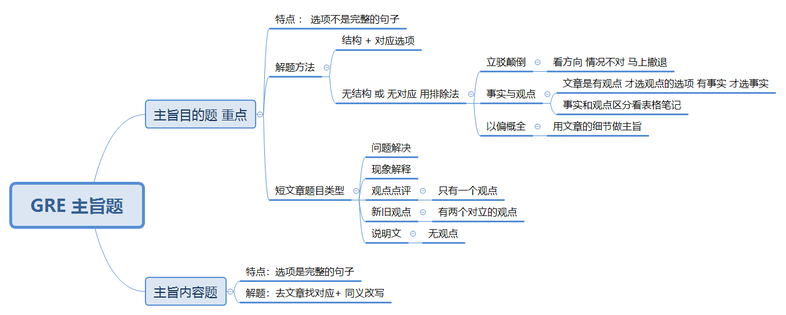

# 总体框架与做题流程

> 整理来源：5.8 短文章主旨题第一节笔记。

阅读重点为短文章
重点看短文章
GRE 阅读不考同义替换
GRE是题型导向的特点gn
如何高效提分
1. 题型为导向 —> 死背公式 不同题型会有不同的解决方案 要背下来
1. 高频反复考 —> 分析高频 只用一个备考资料 365篇的机经 机经的目的是测试你自己解决某类题目的分析能力
1. 遗忘速度块 —> 反复复习

GRE 阅读的做题步骤

先读题  OR 先读文章   建议先读题
先读题 可以了解这篇文章的题型  看文章的时候就比较有目的性
先读文章 的问题在于 1. 是否能读懂 2.阅读速度 要求2分钟一个题 3. 能记住吗
