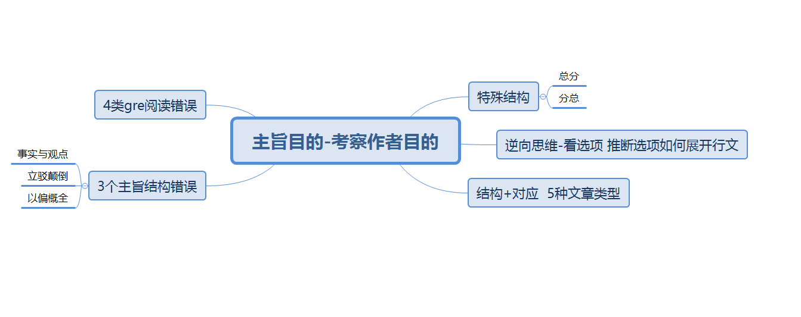

# 主旨题：目的题与内容题

> 整理来源：5.8 短文章主旨题第一节笔记；主旨题录播；5.9 事实信息题录播；5.11 句子作用题 第二次直播；态度题 类比题 否定事实信息题；第三次直播 信息目的 主旨目的。

**主旨题的解法**

|  | 主旨目的题 | 主旨内容题 |
| --- | --- | --- |
| 题干标志 | **  ****问的是作者的写作目的** The primary purpose of the passage is to ... The passage is primariy concerned with | Which of the following best states the central idea of the passage?  Which of the following best describes the main idea of the passage |
| 选项标志 | 非完整句子 | 完整句子 |
| 考点 | 文章结构 | 主旨句定位+同义改写 |

**阅读做题核心原则 一**定要回去文章找对应依据 你要选择一个选项 你要问自己为什么 原文在哪里体现了  不要我觉得 我认为
阅读核心原则2 —全面对应原则 选项的每个部分都能在文章找到对应
**主旨目的题是重点**

**找文章结构 是为了找作者的写作目的**

**一段的短文章结构** 有以下类型 【多段不适用】
1. 现象解释  事实开头
1. 问题解决  事实开头
1. 新旧观点  文章有2个观点 且这两个观点是对立的 是指逻辑的对立 不是按照时间的先后  被反驳的观点是旧观点 新观点是反驳后提出的新观点
      作者的目的是反驳一个观点并提出一个新观点
1. 观点点评 文章观点个数只有一个 没有提出新观点  分为老粉丝性的【一直赞成支持这个观点】 黑粉【不认可这个观点 一般会列出原因反驳 但是不说怎么解决】
1. 说明文 无观点 常有时间维度

**公式区分3和4**
如果文章结构是
1. A -> B
  2. 后面转折 A  \-> B [A 不能推出B]
  3. 之后又说Why A不能推出B
  4. 继续说 A ->X 或者 X->B 提出新的东西
如果只有1 2 3 那么就是观点点评
1 2 3 4 都有那么就是新旧观点

29-2

**前4个是议论文 是备考的重点**

**结构不是万能的，结构不是万能的，结构不是万能的！！！！**
主旨目的题三种情况
1. 有结构 能对应
1. 有结构 不能对应选项
1. 无结构 不能对应选项

如果主旨目的题对应 2. 3 种情况 排除法

主旨题错误选项特征 排除法
1. 立驳颠倒
1. 事实观点颠倒
1. 以偏概全

立驳颠倒 从方向上去判断  选项里的提示词：动词 判断是立论 还是 驳论
方向不对 赶紧撤退

事实与观点：名词 ----- 事实与观点
P = 1 事实   0< P < 1观点
只有文章有事实，才能选事实 
只有文章有观点 文章才能选观点 
事实是决定不能被反驳的
如果发现后一句在反驳前一句 那前一句肯定是观点

选项里的提示词：名词 --------事实与观点
| 事实 | 观点 |
| --- | --- |
| confirmed theory | theory |
| established theory | scientific theory |
| universally accepted theory | widely held theory |
| results/research/study |  |

**以偏概全 ** 就是用文章的细节来当主旨【细节不可能作为主旨】
读主旨时，只用读每句话的主干[主谓宾 主系表]
从句、其他修饰成分不可能作为主干的

**GRE 阅读错误选项特征**

1. 逻辑错误： 与原文矛盾
1. 无中生有： 尤其注意比较 关系种的无中生有 90% 都是错的
1. 扩大或缩小范围
1. 不在定位区间
  
全面对应 可能有部分对应 但是只要有部分错  就是错

题号：117-2
题目类型：主旨目的题 考察作者写作目的
公式：文章结构+对应+3类错误+4类gre阅读错误
第一句观点 第二局反驳并提出对立
文章类型：新旧观点
选项 A正确

B C D E established scentific theory / results  studies / research 
这些是事实 文章主干全是观点 所以错
即使细节有事实 那也是以偏概全

---

## 录播补充：主旨题步骤

主旨题解题步骤

1. 读题，判断题目类型
      主旨内容题 or 主旨目的题
1. 读文章
      首句读完后，确定出讨论对象
       明确是 事实 还是 观点。如果不好确定 再往下看
       剩下句子读完后，确定出文章类型
1. 结合排除法做题

---

## 特殊结构补充

**在阅读当中，如果没有引用标志【没有出现其他人】，可能是事实或者是 作者的观点**

139-1 逆向思维 看选项 推文章怎么写 再看与文章是否对应

主旨目的题+特殊结构 = 主旨内容题 139-1
特殊结构  总分结构比如【数字罗列 1 2 3 】87-1 51-1
                 分总结构  【比如 in short】28-1

---

## 归类后的主旨题课堂例题

题号： 9-1
题干标志：primarily concerned
题目类型: 主旨目的题
所需公式：文章结构+对应+3类错误+4类GRE阅读错误
文章结构：观点开头  两个对立观点  新旧观点
因此选指定 D competing views of an issue
A 没有解决争论
B 支持一个。。。 作者没有表达态度
C E 包含事实 没有说明观点

小克老师：
A resolve 无中生有
B 新旧观点 是驳论文 立驳颠倒
C trace 说明文
E chronic 说明文

题号： 103-1
题干标志：the main idea of
题目类型: 主旨内容题
文章类型：事实开头？ 现象解释 or 问题解决
所需公式：定位主旨句+同义替换
定位到第二句是主旨句
A 选项 以偏概全 data collected in the 1950s
B 无中生有 in  the wild没有提到
C 逻辑错误  have been confirmed 原文第二句是undecided
D 正确  同义替换
E 后半句无中生有 前半句逻辑错误或者说扩大范围 researchers..

题号： 107-1
题干标志：primary purpose 
题目类型：主旨目的 考察作者写作目的
所需公式：文章结构+对应+3类错误+4类阅读错误
文章类型：事实开头【This phenomenon】 现象解释
D 与文章对应
A 立驳颠倒
B 以偏概全
C 无中生有
D 无中生有

题号： 139-1
题干标志：The primary purpose
题目类型：主旨目的题
所需公式：结构+对应 5中文章类型 3类错误+4类GRE错误
定位词：beavers
定位到 第1句 第2句 第7句
没有发现取反的逻辑【时间 数量 对立信息】，因此是正向推断
A 无中生有
B 正确  第2句说不能build dams 第7句又说可以
C 无中生有
D 无中生有
E 无中生有 原文没有给相应的信息

题号： 18-4
题干标志: primarily concered with和选项动词开头
题目类型：主旨目的题
所需公式：结构+对应+反向思维+3类常见错误+4类gre逻辑错误
文章类型：新旧观点
第二段先质疑旧的理论，然后提出一个新的理论
所以答案选A 
要看结构 看主干，看完才做决定！！！

题号: 4-1
题干标志：central idea
题目类型: 主旨内容题
所需公式：定位+同义替换主旨句
主旨句是4句
A 只是文章的细节
B 只是文章的细节
C 逻辑错误
D 对
E best 无中生有
