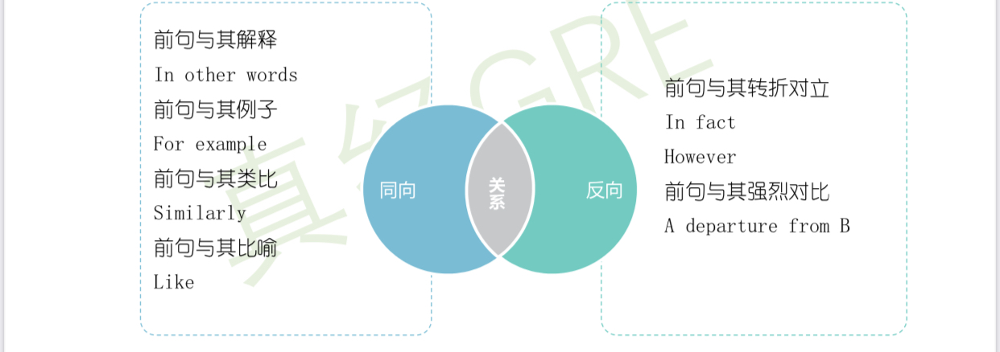

# 句子作用题

> 整理来源：5.11 句子作用题 第二次直播；主旨题录播；第三次直播 信息目的 主旨目的。

## **句子作用题【考察句间句内关系】**

**句子作用题解题步骤**
1. **利用高亮句与前一句的同向反向关系进行排除**
1-1 **考虑的是选项的****动词**
1-2 **没有转折词 那就是正向；有转折词，不一定是反向 因为qualify **       【反向是指前后严格对立】
1-3 **常见的正确答案词 qualify limit  99%正确 限定 修正   部分同意  部分反驳**
常见的反向答案词
challenge
refute
call into question
undermine
cast doubt
1. **优先考虑下列字眼的选项 【考虑前句和后句的关系 即句间的关系】**
- **made in the**** preceding ****sentence**
- **cited in the ****opening**** sentence**
- **expressed in the**** following ****sentence**
- **NB: mentioned eariler in  the passage [先别考虑 eariler 有点模糊 可以指代前面的所有信息]**
1. **阅读高亮句，找出****关键词****，与选项对应**
- ** 读高亮句的主干**

---

## 归类后的课堂例题

题号： 9-2
题干标志：the highlighted sentence served to 
题目类型: 句子作用题
所需公式：三步走
for example 与前面已知 但是did acknowledge有一定程度的削弱
因此选择A 	qualify
B错的 没有纠正
C  证明支持  这里方向错了 是在让步
D E 方向有问题

小克老师：第三局在修正 与前面观点保持一致

题号： 31-1
题干标志：highlighed
题目类型：句子作用题
所需公式：判断方向+preceding sencete+ 看主干 + 与选项对应
However, 反向
B E 排除
D 正确  
A 不对应 问题的时间早晚
C 不对应
