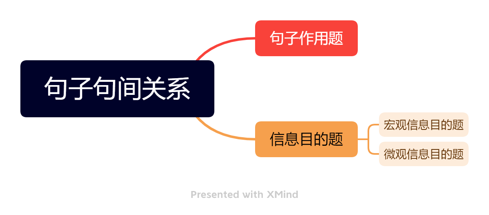

# 信息目的题

> 整理来源：第三次直播 信息目的 主旨目的。

### **信息目的题 【标志 primariy to  in order to  】 考查****句间句内****关系 他与高亮句的区别在于他是拿一个细节来**问

夹逼定理 看前后!! 解决 **句间句内关系**

**有些提示可以帮助我们知道考的是句子内部关系：比如 ：， ——， since ... , due to ... 括号等等**
**有些是明显的句子间的关系：比如 for example**

### **微观信息目的题 **

**是指 in order to 后面有动词的题！！！作者已经用动词给了方向**
**比如 primarily to suggest**
**我们关注的是****定位句的本身，关注已经提到的对象****！！！**
**句子内部做不出来，再看句子间**

Em
A . 无中生有 没有提到origin
B 正确 后一句是转折 与前一句相同 体现与前一句的正向 和后一句的方向
C histroical legacy 无中生有
D 不能全面对应 与第二句不是同一个问题 犯了一个常见错误 用自己回答自己 【这题问的是Emerson 提出问题的目的 D选项翻译 就是 提出问题的目的是引入问题 还是说的信息本身，没有谈论作用】
E 无中生有
**take issue with == disagree**

## 课堂例题 31-2

题号： 31-2
题干标志：in order to 
题目类型: 信息目的题
所需公式：定位+句间关系+夹逼定理
natural trends 定位到第二句话
发现前面有冒号 考察句内关系 为冒号之前服务
E正确
A 不对应前一句 时间早
B 描述冒号后面的内容 在强调信息本身 没有说作用
C 与表达的意思相反
D 与B 一样
