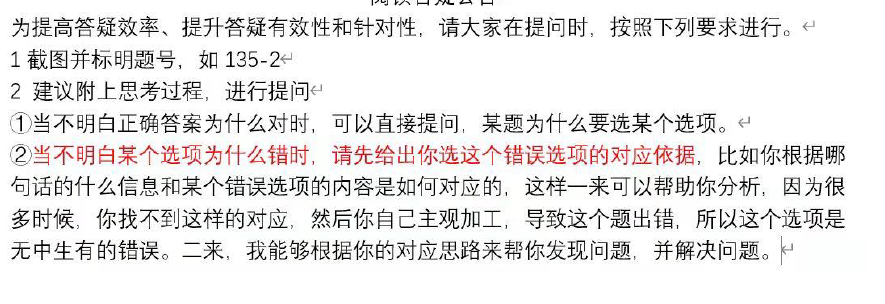
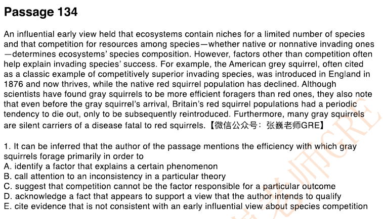

# 做题练习

> 整理来源：做题练习.md。

题号： 30-1
题干标志：According to the passage
题目类型: 事实信息题
所需公式：定位+同义替换+GRE4类错误
定位词：“weathered material Martian surface”

定位到第二段第二句。
同义替换 选择 B
A C D E 无中生有 

题号： 30-2
题干标志：infer 
题目类型: 推断题+多选
所需公式：定位+推断逻辑+4类错误
定位词：“highLighted sencentce”
B  第一段科学家基于高亮句的推理，由于没发现相关物质，所以没有哪个结果，后面证明发现了物质。
**高两句是研究者用来支持观点的假设推理**

题号： 34-1
题干标志：mention primarily  in order to 考察句间句内关系
题目类型: 信息目的题
所需公式：夹逼定理 看前后 和一些特殊的符号 提示比如for example

doubt 与前面关系是反的 是在质疑前面的观点
C 
根据方向 排除  ABDE

题号： 34-2
题干标志：According to the passage
题目类型: 事实信息题
所需公式：定位+同义替换+4类gre错误
定位词：Bonito phase
全文都在说 没法定位 可以通过选项定位 看选项
A  正确 第二句得出 in some cases less often 对应 Relatively few of ...
B 无中生有
C 无中生有
D 无中生有
E 无中生有

题号： 36-1
题干标志：priamariy in order to 
题目类型: 信息目的提
所需公式：夹逼定理 句间句内关系
定位到第二句。
A 排除
B 是说的是句内关系 只有B 了
C 无中生有
D 不是这个关系
E 逻辑错误

题号： 36-2
题干标志：which of  the following  in the passage
题目类型: 事实信息题
所需公式：定位+ 同义替换
hypotheses elements.
定位到 accodintg to one hypothes. accoring to another hypotheies,
D 

题号： 36-3
题干标志：infer
题目类型: 推断题
所需公式: 定位+推断逻辑+4类gre阅读错误

定位到So most attempts
E
BCD都是基于goal提出的尝试的细节
A是其中的一个问题

题号： 44-1
题干标志：The passage mentions
题目类型: 事实信息题
所需公式：定位+同义替换+4类错误
定位词:extoic pests  effects on forests ecoy
ABC 第二句 第三句

题号： 44-2
题干标志：in order to explain
题目类型: 微观信息目的题 考察句间句内关系
公式：夹逼定理+特殊符号连接词

定位到最后一句
句内because 因果关系 这是为了第4句服务 解释
A 错误 没有解释为什么
B 错误
C 正确
D 错误
E 无中生有

题号： 45-1
题干标志：infer
题目类型: 推断题
公式：定位+推断逻辑+GRE4类错误
定位到第3句  第4句
A 正确
排除B 
C 无中生有 且 提到的句子与mahogany和teak有先相同的特点
B正确  unmathced 这里是无与伦比！！！ 没有with
而且根据后句 也是正向，所以可以知道这里是不是翻译为不匹配
  
题号： 45-2
题干标志：
题目类型: 词汇题
公式：当成填空题来做

E 

题号： 47-1
题干标志：which of the following ..as an explanation
题目类型: 事实信息题
公式：定位+同义替换+4类错误

A 无中生有
B 逻辑错误 divere in skill requeriments
C 无中生有
D 不是tradition analysis s是 hunter
E 提到了 正确

虽然 D 文中有 但是不是 historicans 要小心啊1!!

题号： 47-2
题干标志：infer
题目类型: 推断题
公式：定位+正反向推断逻辑+4类GRE错误
A正确
B togther hunter 是反对的 分开就是支持的 答案的解释：B是historians 分开研究的原因
C 无中生有

题号： 48-1
题干标志：highlighted sentence
题目类型: 句子作用题
公式：考察句间句内关系 。解释三步走公式
高亮句在反驳前面的answer
C D E 排除 方向不对
A  错误 质疑观察的准确性 不是观察 是质疑解释！！！
B 正确 反驳前面的解释

答案：

A B 排除 前句和后句没有转折关系 是正向
可以直接选E 了 

我直接看到no-evidence 认为就是削弱 ，这是作者反向论证！！！

题号： 50-1
题干标志：primaiey with
题目类型: 主旨目的题 问作者写作目的
公式：文章结构+3类错误+4类GRE错误
文中现象解释。说名一种解释不成立
A 正确
B 错误 没有什么conflicting data
C 解决一个矛盾？ 没有解决
D compare 作者是没有立场的 文中有立场
E 全文没有反驳 都在支持一个观点

题号： 50-2
题干标志：in order to 
题目类型: 信息目的题 考察句间句内关系
公式：定位+夹逼定理+特征词
For example 作为例子 是为了证明前面 作为论据
C 正确

题号： 51-1
题干标志：primaiey with
题目类型: 主旨目的题 问作者写作目的
公式：文章结构+3类错误+4类GRE错误
文章有两个观点。一类赞成 一个反对 作者没有表态
A 正确
B 没有踩
C 没有similarity
D defend 作者没有态度
E define? 错误

题号： 51-2
题干标志：infer
题目类型: 推断题
公式：定位+推断逻辑+4类GRE错误
定位词：new historicists agree the deconstr
A 只会有 new histro
B 正确
C 只有deconstr

题号： 51-3
题干标志：infer
题目类型: 词汇题
公式：定位+推断逻辑+4类GRE错误
 devalue的反义词
B 

题号： 52-1
题干标志：infer
题目类型: 推断题
公式：定位+推断逻辑+4类GRE错误
定位词：univeristy hall

C 正确

题号： 52-2
题干标志：The passage suggests
题目类型: 推断题
A soudproof 没有
B 正确  错误 **out of 是缺乏**
C 错误 不是没有echo
**D 正确**
E 无中生有

题号： 54-1
题干标志：suggests
题目类型: 推断题
公式：定位+推断逻辑+4类GRE错误
B 根据倒数一二据推断出
A 没有提到 harm components
C  正确  这个运动形成flex 融化ice

题号： 54-2
题干标志：highlighed sentence to introduce
题目类型: 微观信息目的题 
公式：考虑句间句内关系
与前一句是正向关系 是举例子这个证明
A  根据后文 这个东西并没有被证实
B 正确  后面又具体的观察发现 推测比较合理

题号： 55-1
题干标志：the primary purpose
题目类型: 主旨目的题
公式：文章类型+3类错误+4类GRE错误
文章结构  一些人去挑战一个观点
之后这个观点的提出者做出了反驳
A correct  historal period 错误
B 错误
C 错误 evidence
D 正确
E 错误

题号： 55-3
题干标志：
题目类型: 词汇题
公式：当作填空题来做
这是旧观点 
新观点是指民众对 two-party regime 是 antipathy
旧观点就是正向的词汇
D E 区分不了
C 排除
A 

题号： 56-1
题干标志： According to the passage
题目类型: 事实信息题+
公式：定位+同义替换
定位到第二句
A 无中生有
B C

题号： 56-2
题干标志： infer
题目类型: 推断题
公式：定位+推断逻辑+4类GRE错误
定位倒数1，2句
A 无中生有 deficient
B The extent 无中生有
C 正确

题号： 58-1
关键词：explanation trend
第二句 due to 

题号： 58-2
题干标志： accoring to the passage
题目类型:事实信息题
公式：定位+同义替换
recent studies 定位到第一句
A 无中生有/不在定位区间
B unduly voter preferences
C 无中生有
D regional differnces 无中生有
E 正确 同义改写

题号： 58-3
题干标志：cites .to
题目类型:信息目的题 考察句间句内关系
公式：定位+4类GRE错误+步骤
因果关系 due to 
B 正确

题号： 58-4
题干标志：the passage concerned with
题目类型：主旨目的题
公式：文章类型+3+4
观点点评
B 

59 做过

题号： 60-1
题干标志：infer in order to 
题目类型: 推断题+信息目的题
公式：定位+推断逻辑+4类GRE错误
定位词：Ellison apprenticeship
定位到第二句 第三句的yet 是部分转折
A 无中生有
B 无中生有
C leading figures 无中生有
D 无中生有
E 正确 qualify 后文说他对visual arts很谨慎 且更习惯用语言，定位句是在正向说明visual arts

reservation 还有怀疑的意思...

题号： 60-2
题干标志：infer
题目类型: 推断题
公式：定位+推断逻辑+4类GRE错误
定位词：tension
定位到最后一句和倒数第二句
倒数第二句出现了only    对立信息取反？
A  social injusices 无中生有
B 无中生有 as aresult of 因果关系
C 正确  this complexity only lanagues
D within the IDEALS 错 还有后面一推东西 未能完全对应 缩小了范围
E 逻辑错误 文中是only language 与选项相反

61 做过

题号： 62-1
题干标志：primary purpose of is to 
题目类型: 主旨目的提 考察作者写作目的
公式：文章结构+3类GRE错误+4类GRE错误
文章只有一个观点 然后说明这个观点站不住脚
在否定
A 错误 compare two
B 正确 后文在呈现证据 反驳 
C  错误 in  a set of findings  在堆研究中指出不一致性  不是在一系列研究 作者是在反对一个观点。
D 解释观点嘛 不是
E Origin无中生有

题号： 62-2
题干标志:accoring to the passage limited evidenc
题目类型: 事实信息题  **这句话是再问limited evidence本生的内容，不是这句话的功能**
公式：定位+同义替换
用来支持作者反对的观点
**A 正确**
B 错误
C 错误 不是强调国家间的相似性
D 错误 在这些国家存在这些！！！
E 方向错误

题号： 62-3
题干标志:归纳题加作者态度题  
题目类型:
**题目问的是老观点和新观点的相似之处**
**因此选择E 当时看题也很懵逼，怎么作者也接受了旧观点！！！长个记性 **
accepting the propositon.
就是第一句话的观点
A 正确 错了
B 与原文观点相反
C constant 文章是increasing
D 没有提到
E 正确

题号： 64-1
题干标志:the primary purpose
题目类型：主旨目的题
公式：
**文章结构是不同人对一个人的不同评价 且由时间线**
A SImilarity
B 正确 xxx 作者没有战队 哪有defend
C **正确** discuss a change 
D 错误 
E 以偏概全

题号： 64-2
题干标志: suggest
题目类型：推断题
公式：定位+推断逻辑+4类GRE错误
定位词：M A
A  不在定位区间
B 正确
C 无中生有
D 不在定位区间
E 无中生有

题号： 64-3
题干标志: suggest
题目类型：推断题
公式：定位+推断逻辑+4类GRE错误
定位词：Gakel advance
定位到第一句和第二句
A  错误原文说的是 E GXX 句子成分的问题 不看清楚！！！！
B 无中生有
C 无中生有
D 逻辑错误
**E 正确**

题号： 66-1
题干标志：differ which
题目类型: 归纳题+事实信息题
公式：定位+同义替换
B 正确
根据原文倒数第二句 一个是across the nation 一个是 produced in northeastern states.

题号： 66-2
题干标志：the pasage cite which
题目类型: 事实信息题
公式：定位+同义替换
定位到第二句
D 正确

题号： 67-1
题干标志：in order to 
题目类型: 信息目的题
indeed 解释说明前文
A 不知道说的是啥 
B **错误 被没有relaced by  state spsoner ship 无中生有**
C 
D 没得关系
E 错误 没得关系  正确  因为后文强调他的那封信并没有标志一个end,这句话表明他还是在接收资助 正确！！！

题号： 67-2
题干标志：highted
题目类型: 句子作用提
公式：句间句内关系
However 与前文是转折关系
C 正确

题号： 67-4
题干标志：infer
题目类型: 推断题
公式：推断逻辑+定位+4类GRE错误
根据高亮句 反向推断
C 正确

题号： 68-1
题干标志：Accoring to the passagge
题目类型: 事实信息题
公式：定位+同义替换
定位到第三句
A 正确
B 逻辑错误
C 逻辑错误
D 无中生有
E 无中生有

题号： 68-2
题干标志：imply 
题目类型: 推断题
公式：定位+推断逻辑+4类gre错误
定位到最后一句
A 逻辑错误 应该是在Africa的
B 无中生有
C 无中生有
D 正确 应该能够过去 反向推断
E 逻辑错误 应该是Africa

题号：68-3 
题干标志：Accoring to the passagge
题目类型: 归纳题和事实信息题
A  无中生有
B 逻辑错误
C 无中生有  a large habitats 文中并没有提供关于任务栖息地大或少的信息
D 无中生有
**E 无中生有 正确 long time 和 short lag 在文中的对比**

题号：79-1 
题干标志：indicate
题目类型: 推断题
公式：定位+推断逻辑+gre4类错误
定位到倒数第二句
**AB  **

题号：79-2
题干标志：Accoring to the passagge
题目类型: 归纳题和事实信息题
**A 正确 in her eyes 与视觉有关 选择A**
E 找不到对应

题号：92-1
题干标志：mention in order to 
题目类型: 信息目的题 考查句间句内关系
冒号：解释说明
A a factual error 无中生有
B emptiness无中生有
C 不在定位区间
D 正确
E 无中生有

102 做过

105 做过

106 
题号： 106-1
题干标志：the function of the higlighted sentence
题目类型: 句子作用题
这个题和前一句同向 与第一句反向
A 没有解释原因且动词不对
B 正确
C twentieh 无关
D QUESTION 
E 无中生有

107 做过

108 做过  D 
A

112 
D 
E

115 E  做过
E

116
D
A

117做过

118
118-1 A B 事实信息题 定位+同义替换 定位最后两句 分别对应B A
118-2 C  句子的作用一个是用来证明旧观点  A错误在于 后文并没有证明划线有问题
B 正确 那就是B呗！！！
C 错在无中生有 applied in a branch of science

120-1 B
120-2 C

121做过
121-1 C
121-2 B

123-1  C
123-2  B
123-3  A
123-4  A   D   A错在 我不是在解释事件发生的原因 我是在解释他的影响！！！
123-5  A **  D  POINT OUT H COLLING BENEFITS THE ALGE!!!**
123-6  D E  D scientiset be able to understand ...无中生有  A 错误的 温度的作用.. 并不是温度的作用

124-1 B 
124-2 E

**125-1**

A  a factor  draw conclusions abouth the behaviour....无中生有
B 正确
C 错误
D 文中有反对吗 没有反对 都没法证明 作者没有下结论
E 错误 无中生有

文中 作者是在倾向culture这边 skeptics 是demand clear evidence
作者是在说这个证据不好拿到 是反对skeptics的 看句子 主谓宾啊！！！！
125-2
A  错误，有social learning
B 无中生有
C 错误 他们会模仿
D 无中生有
E 无中生有

做过
 126-1
C 正确

126-2
A  originate 无中生有
B 正确
C 无中生有
D 无中生有
E 无中生有  oldest

126-3
E

127-1
事实信息题 定位到第一句和第二句
E 

127-2
推断题 定位 most sei 定位到第一句
A 正确 通过后文
B 错误
**C  不知道 文中没给 无中生有**
正确 根据第一句 同义改写
**128**
128-1 
A 错误 没管那两个观点的事情 提出了一个新的 反驳了那两个
C 错误 正确  众人的观点也可以称之为 a particular understanding 一个转折把前面全否定了
E 错误
D various reasons 错误
B 错误 the relevance of certain data 无中生有！

128-2
A  正确 important
B 正确
C 都提到了 also 正确

128-3
**only to terrestiral resoures  only 反向推断！！！！**
**A ...**
**没反应过来 而且通过evan定位真的没啥用**

129-1
A 无中生有
 B
C 无中生有

正确答案 ABC  C  exacting sense of fact
129-2 B **polemical**

130-1 A
全文通过Austrilia的对比 来反对第一句
B 不是现象解释
C 没有提出一个新解释 支持在反对
D 没有纠正 就是在反对
E 质疑比较，无中生有

130-2
imply推断 25，000ago 时间
时间推断取反?
定位到最后一句
如果正向推断
文中是美国和澳大利亚比较
E无中生有
A B  D比较关系的无中生有
**C 正确 错误**
**E 正确 根据 sea-level rise推理出**
**C项的对应与定位句不符合！！！ 没有population **
**定位有问题**

130-3
imply 推断题
文中没有直接给出 但是文章一致在反对第一句的观点
通过时间推断 殖民时间靠后
D 正确

131-1 句子作用题
支持前一句 反对老观点
E 无中生有
D Physiologic 无中生有
C 无中生有 讨论的calorie restrcition
B probabe means...无中生有
A 正确 provide example 反对前面的观点

131-2 多选题+推断题
态度题 
A 正确 根据第一题
B 逻辑错误
C 无中生有... uniformly positive. 原文解释这个carieo restirction 没有说对所有都一致。

132-1 主旨目的题 结构+对应+错误
一个观点+截然相反观点+支持旧观点
A 事实与观点
B 正确
C 以偏概全
D Challenge 不是观点点评
E more complex 无中生有

132-2
weaken 逻辑削弱题
A  正确  working 在增长 时间不对
B 工人变少 是加强
C 无关选项
**D 正确 retrained !!! 看成restrained**
E 加强

132-3
infer 推断题
A  正确 less desirable 文中是 less income 保留
B 无中生有
C 比较关系无中生有
D 逻辑错误
E 逻辑错误

134-1 infer+ 信息目的题
**问的是这个信息 不是这个句子 我做成句子作用题了**
定位到倒数第二句
支持新观点
A 解释一个现象 不是
B 
C 错误 根据前面例子 For example 作者没有反对competiton的作用。
D 正确
B E无法分辨

134-2 推断 atuthor 对 early view 
A 无中生有 means into ecosystme
B 逻辑错误
C 正确
D 无中生有 few spies and complex sysytems
E 不是淡化

做过
135-3 文章结构
文章第一段讲区别 第二段展开其中的一个区别
A 错
B 正确
C 错误 以偏概全
D call in to question 错误 E 无中生有 ambitions aims 排除

137-1 事实信息题
定位到第一句
A 正确
B 正确
C 正确

137-2 推断
定位+推断逻辑
**定位到倒数第二句、最后一句 多看一点**
 A 比较关系的无中生有
B  比较关系的无中生有
C 不在定位区间
D work in differnt 不是很准确 E 更好！！！
**E 正确**

做过
139-1 主旨目的题
文章类型+结构+3+4
解释性文章
D 正确

139-2句子作用题
also suggest 同向
C 正确

**有点难 绝对算难题**
141-1 主旨目的题 两端 主要看第一段
A 没有confirming
B 正确 
C new inforamtion 无中生有
D predicting new 无中生有
E 没有比较观点

141-2 infer 推断题
 with such discreapncies
有云可以 没有云就不行 这个原因是什么
A 正确  模型就是没有把云考虑进去 up-to-date infor 无中生有
B 我觉得反了 无中生有
**C 错误 正确  第一个给了信息不同的云作用不一样**
DE 无中生有
第二段第一句That引导的主语从句！！！

141-3 定位到最后一句
**定位定错了 答案的参考是定位到第一段！！！！**
**题目第一句 就是题干！！！ 定位定错了**
**第一个观点 是 decrease 是 strat .. clous 第二个观点  on the other hand cirrus cloud increase**
**所以要知道是那种类型 才知道是increase 还是 decrease**
**A 正确**
D 猜的 从on the other hand 

142-1 主旨目的题 第一句 文章结构+3类错误+4类GRE错误
E 无中生有  a theory that many have believed
A 错误 identify the influcens 
B impactors 以偏概全
C 正确 dubious evidece 无中生有 科学家double的是观点 没有存疑的证据
D  正确 explaint 值得是herbert

142-2 信息目的题
A  不在定位区间 这是后面句的内容
B 不在定位区间
C distingus 方向不对
D 无中生有
E 正确

142-3 推断题 全文都在说这个
定位到倒数第二句 modern tectonic theory
A 无中生有
B 比较关系的无中生有
C 正确 通过like the classifcal geoloyg 和最后一句
D无中生有
E 无中生有

143-1 句子作用题 句间句内关系
however 反向
A 方向不对
B the reila... 无中生有
C 无中生有
D 方向不对
E LIMITS 正确

143-2 事实信息题
定位+同义替换
4000 years ago human impack很弱 是 climate的原因
A 不对 原文说很弱 不代表没有
B 正确 第二句
C 逻辑错我
D 无中生有
E 无中生有

144-1 句子作用题
就是解释前文的作用 概括提炼了
A 正确
B 无中生有
C 
D 无中生有
E give a reason？ 无中生有

144-2
infer 推断题 +定位+推断逻辑
定位到3-4句
A  无中生有
B 逻辑错误
C 逻辑错误
D 正确
E 无中生有

145-1 主旨目的题
A  错误  以偏概全
B  正确
C QUETION 错误
D COPARE w无中生有
E 无中生有

145-2 信息目的题
E  正确 错误
我没有读懂原文的话 current speeds是无关因素
B 这题 很简单的

146-1 信息目的题
例子 真名观点 都有 since有
A 正确
B compare 错
C 不在定位区间
D 无中生有 
E 无中生有

146-2 事实信息题
定位+同义替换 定位到最后一句
C 正确 对应 sheer ubiquity

147-1 主旨目的题
反驳两个可能性
**A 正确 错误 没有质疑研究 质疑的是研究的解释**
**B 正确**
**C 无中生有 importance**
**D 以偏概全**
**E **

147-2  有人动物回去 作者暗含的假设就是 回去的距离也比较远
逻辑假设提 选项取反 削弱结论
D 正确

147-3
imply 推断题
定位到倒数第一句和第二句
with larger cluthches finess benefits
反向推断
A 正确

题号： 152-1
题干标志：which most likely to agree
题目类型: 归纳题
最后做
D 
2 3 4分别对应 1 2 4段
有理由猜测第一题在第三段
排除 A C 这是第一段的内容
B 比较关系的无中生有

题号： 152-2
题干标志：the most logic objection
题目类型: 逻辑削弱题
定位到最后一段和倒数第二段
倒数第二段在论证最后一段的结论
论据：1. 参与革命的人不记录 
           2. 又重要作用的人出席那的地方很少
           3. 革命领导者的记录不可信
B 
1830和1848都是成功的革命 倒数第二段那这两个做的例子，所以选项涉及者两个的比较都是错的 排除A C E   D是less reliable 加强了结论

题号： 152-3
题干标志：the  purpose of ...
题目类型: 主旨题  选型时完整选项 主旨内容题
公式：定位+同意改写
this relative neglect  this 对应第一段的最后一句
lack 对应neglect
D 正确

题号： 152-4
题干标志：infer 
题目类型: 推断题
公式：定位+推断逻辑+4类GRE错误
定位词  revolutionary mobilizaiton
定位到第一段的最后一句
而且又only !!!!  对立信息取反
只在二月革命 缺乏！！！ 其他就不缺乏
说明是必须的
E 

难文章
154-1 主旨内容题 找中心句
看到转折句 第4局 
选择A

154-2 事实信息题
定位词 Hume's reputation  in eighteen century
定位到最后一句
A 无中生有
B 正确
C 无中生有
D 因果关系无中生有
E 无中生有

154-3 句子作用题
作为一个例子 证明第一句观点
D 正确

154-4
信息目的题 定位到最后一句
**E**
**C **

题号： 168-1
题干标志： 
题目类型: 逻辑单题
逻辑 如果是大众脸，为什么有一颗痣
A . 无关选项
B. 无关选项 other cultures
C. 无关选项
D. 无关选项 与流不流通没关系
E. 正确 表明molb不能作为证据

**175-1**
**第4句**

**175-2 事实信息题**
**A 正确 错误 no longer 过于绝对**
**B 无中生有**
**C 正确**

**177-1 多选+事实信息题**
**定位到最后一句**
**A 正确**
**B 正确**
**C 无中生有**

**177-2 词汇题 当成填空来做**
**A 正确**

**184-1 微信信息目的题 更加关注句内**
**定位到第四局 证明是私人的不是公共的**
**A 正确 就是说明例子**

**184-2 归纳题/结构题**
**D 正确**

**184-3 事实信息题**
**literary heir 第三句 derived from**
**C 正确**

**193-1 asserts事实信息题**
**定位+同义替换**
**文中第二句。**
**A 无中生有**
**B 正确**
**C 逻辑错误**
**D 逻辑错误**
**E 无中生有**

**193-2**
**归纳提**
**A 逻辑错误**
**B 正确 定位到倒数第二局**
**C 无中生有**
**D 无中生有**
**E 无中生有 florished in the....**

**201-1 归纳题 最后做**
**E 从最后一句可以推断出 证据不足**

**201-2 infer 推断题+归纳题**
**通过人名定位**
**定位到第三句**
**A storage 无中生有**
**B 无中生有**
**C 正确**
**D 无中生有 Early excavations disturb**
**E ****正确 无中生有**

**201-3 推断题**
**Judd's field**
**两处提到了judd**
**倒数二 三局**
**A 正确 正向推断倒数第二句**
**B 无中生有 文中用的是possible**
**C 无中生有**
**D 无中生有**
**E 无中生有**

**202-1 逻辑削弱题**
**定位到1984 survey 最后一段**
**A 无关选项**
**B 无关选项**
**C 正确**
**D **
**E 无关选项**
**202-2 事实信息题**
**定位词skeptics 定位到第一段最后一句**
**A 无中生有 rice-farming existence**
**B 正确**

**202-3 推断题定位+推断逻辑**
**A unconvetional无中生有**
**B 逻辑错误**
**C 无中生有**
**D 正确 根据第一句**
**E 逻辑错误**

**205-1 主旨目的题 开头+结构+3+4**
**事实开头 然后解释 + 反驳回来**
**A	无中生有 similarly structed works**
**B  正确**
**C 无中生有**
**D similiarliy 错误**
**E 无中生有**

**205-2 推断题 定位the critics' complaints**

**定位到第二句 第三句**
**A 正确 第三句**
**B 无中生有**
**C 错误 与稳重第二句不符合**
**D 无中生有**
**E 不在定位区间**

**205-3 结构体 和第一题类似**
**A 错 缺乏反驳**
**B relative merits 无中生有**
**C 逻辑错误**
**D 正确 最合适**
**E Agreement between two sides 无中生有**

**206-1 主旨目的题**
**反驳一个观点**
**A 正确**
**B 错**
**C social significantce 无中生有**
**D why 错误 没有说原因**
**E 以偏概全**

**206-2 句子作用提**
**A 正确**
**B 逻辑错误**
**C 无中生有**

**重点看**
**212-1 主旨目的题**
**一个发现证明之前是错的，后面又有新证据解释之前的东西**
**如果一篇文章有两端及以上，主旨题考察的是文章的段落关系**
**A 以偏概全/ 无中生有 dangers**
**B 没说明困难啊**
**C 正确 第一段是旧证据 第二段新证据**
**D 无中生有**
**E  how difficult 没说**

**212-2**
**针对的是不同的事件**
**A 正确 **
**B rejected 无中生有**
**C a set fo observaton data无中生有**
**D 无中生有**
**E 无中生有**

**212-3**
**推断题 定位**
**有虚拟语气**
**A 逻辑错误**
**B 无中生有**
**C 无中生有**
**D 正确 推断的 第三句**
**E 无中生有**

**重点看！！！**
**215-1 imply 推断题**
**定位+推断逻辑**
**定位到第二句**
**Sepencerian 重理论**
**A 正确**
**B 无中生有/不在定位区间**
**C 无中生有**
**D 不在定位区间**
**E 无中生有**

**215-2**
**imply 推断**
**定位到最后一句**
**长难句分析 shift from A  to B and C **
**A  betterment 无中生有**** 正确**
**B the observation of particular 退u但**
**C 无中生有**

**215-3**
**定位到最后一句**
**A 正确 无中生有**
**B 错误 正确 根据上一题**
**C 无中生有**

**重点标记**
**216-1**
**推断题 定位到**
**事件推断**
**before 6500 no ceral cultivation**
**定位错误 全文都在6500这个时间点下**
**A 正确 最后一句的推断 正确**
**B 逻辑错误**
**C 错误**
**D 无中生有**
**E 无中生有 the types of plants**

**216-2**
**infer 推断题**
**问的是Yngzi Basin **
**A 错误**
**B 正确 根据第三句**
**C 错误 无依据**
**D 因果关系无中生有**
**E likeyly 而且不是South China**

**227-1 主旨目的题**
**感觉在说明文 有事件**
**A parallel effects 无中生有 ****过于细节**
**B 无中生有**
**C 无中生有**
**D 无中生有**
**E 也很正确 这个更好**

**227-2**
**事实信息题 定位到第二句**
**A 正确 **
**B 错误**
**C 无中生有**
**D无中生有**
**E 无中生有**

**227-3**
**推断题 定额我i到最后一句**
**E 正确 began to 无中生有**
**D 无中生有**
**C 无中生有**
**B 无中生有 B 正确 反向推断**
**A 无中生有**

**245-1**
**词汇题**
**E**

**245-2 推断题**
**定位+推断逻辑**
**定位到第三句 第四局**
**E 正确**
**其他无中生有**

**245-3**
**推断题**
**A 逻辑错误**
**B 逻辑错误**
**C 逻辑错误**
**D 正确 最后一局 not have been used in loud group**
**E 无中生有**

**250-1**
**infer 推断题**
**定位词 mediecval**
**全文都在说 不好定位**
**定位到最后一句**
**定位到第一句**
**A 无中生有**
**B 正确 定位到最后一句 discovered the remarkable tide-raising**
**C 无中生有**
**D skilled in。。 无中生有**
**E 无中生有**

**250-2 推断题**
**Hodgson 定位到第二句**
**A 逻辑错误**
**B 无中生有**
**C 正确 错误 细节**
**D 因果关系无 中生有**
**E 正确 其实做了第二题 就是知道C是错的**

**250-3 主旨目的题**
**第一句  文章结构+3+4**
**提出一个记录 然后反驳 之后又被反驳回去 又有疑问 之后又解释**
**A 无中生有**
**B 无中生有**
**C 正确**
**D 太细节**
**E supports the veracity 无中生有**

**256-1 suggest 推断题**
**定位词 bryoaon barn.. capti**
**定位到第4句及以后**
**A 正确 **
**B 错 前两个不符合**
**C 无中生有 或者 最后一个不符合**
**D 后一个不符合**
**E 无中生有**

**256-2 推断题**
**定位到hypotheis**
**定位到第三句**
**A不在定位区间**
**B 正确**
**C 不在定位区间**
**D 不在定位全金**
**E无中生有**

**256-3 主旨目的题**
**现象 提出解释 然后提出另一个不一样解释**
**A 无中生有**
**B 无中生有**
**C 无中生有**
**D 正确**
**E无中生有**

**257-1 主旨目的题**
**我觉得是在解释 why discounted**
**A 错误**
**B expand the term work 无中生有**
**C 正确**
**D 细节 太细节**
**E 无中生有/以偏概全**

**257-2**
**事实信息题**
** of repreesent rural labor**
**找准成分**
**D 正确**

**257-3**
**归纳题**
**文章最后一句**
**强调leisure和work的定义问题**
**A 无中生有  也有提到 倒数第二句文中  正确**
**B 猜的 正确 但我感觉和原文相反**
**C 无中生有**
**D 无中生有**
**E无中生有**

**重点看**
**260-1**
**事实信息题**
**定位到最后一句**
**A 错**
**B 比较关系无中生有**
**C greatly 无中生有**
**D 无中生有**
**E 正确**

**260-2**
**推断题 + 信息作用题**
定位定错了 是在第三句
**A 正确 错**
**B 错 正确**
**C正确**

**260-3**
**感觉是qualify的意思**
**A 无中生有**
**B the faragililt 无中生有**
**C 无中生有**
**D 错误  正确 indirect evidence对应**
**E 无中生有**

**260-4**
**D maxim**
**E 对应pattern**

**274-1 归纳题**
**A 无中生有**
**B 无中生有**
**C 无中生有**
**D 无中生有**
**E 正确 最后一句 **

**274-2 事实信息题**
**定位词 novel geross 全文都有**
**A 无中zz**
**B 征取 根据第二句推断 tiresoomely earnest**
**C 逻辑错误**
**D 无中生有**
**E 无中生有**

**274-3 信息目的题**
**引用这个是是证明1. 他的一个特带你 2与前面不符合**
**A 正确 就是强调不与geroges 不一致**
**B 无中生有**
**C 无中生有**
**D 在例子中之处不同 不对吧**
**E 错误 自己解释自己**

**276-1**
**事实信息题+多选**
**ant interactions**
**定位到最后一句**
**A正确**
**B 正确**
**C 无中生有**

**276-2**
**ordered == rhthmic 有节奏的 有韵律的**
**A B 同一个意思 排除**
**E 负向 排除**
**D 正确**
C regular

**280-1 事实信息题**
**A 只提到size的信息**

**280-2 词汇题**
**cools 找对应**
**根据后文 后面他是比较活跃的**
**前面就是死的呗**
**B  **
